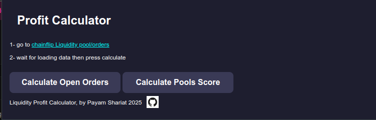
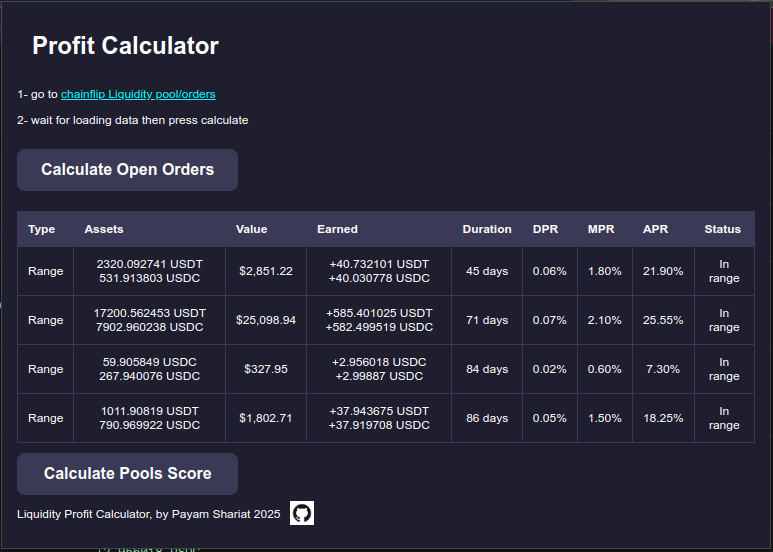
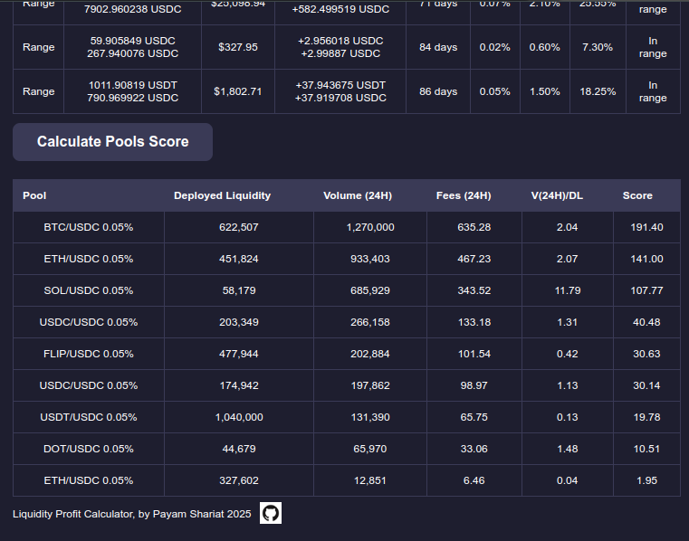

# Liquidity Profit Calculator Chrome Extension

Liquidity Profit Calculator is a Chrome extension that calculates liquidity profits on lp.chainflip.io.

## Features

- Extracts data from lp.chainflip.io
- Calculates Pool Scores to evaluate investment attractiveness based on metrics like Volume-to-Liquidity Ratio, Fees, and Risk Factors
- Calculates Daily Percentage Rate (DPR), Monthly Percentage Rate (MPR), and Annual Percentage Rate (APR)
- Displays results in a table format with color-coded APR

## Documentation

For detailed calculation logic and methodologies, refer to the following files:

- [Open Order Calculator](./open-order-calculator.md): Explains the calculation logic for open orders, including DPR, MPR, and APR.
- [Pools Calculation](./pools-calculation.md): Details the scoring system for pool rankings and investment attractiveness.

## Installation

1. Clone the repository to your local machine:
    ```sh
    git clone https://github.com/payamss/liquidity-profit-calculator.git
    ```

2. Open Chrome and navigate to `chrome://extensions/`.

3. Enable "Developer mode" by toggling the switch in the top right corner.

4. Click on the "Load unpacked" button and select the directory where you cloned the repository.

## Usage

1. Navigate to lp.chainflip.io/orders in your Chrome browser.

2. Click on the Liquidity Profit Calculator extension icon in the Chrome toolbar.

3. Click the "Calculate Profits" button.

4. The extension will extract data from the page, calculate the profits, and display the results in a table format.

## Screenshots

### Video Demo

[](https://youtu.be/0MfdhB6BgXw)

### Extension Popup



### Open Orders Calculation



### Pools Score Calculation



## Files

- manifest.json: Contains the extension's metadata and permissions.
- popup.html: The HTML file for the extension's popup.
- popup.js: The JavaScript file for the extension's popup logic.
- style.css: The CSS file for the extension's popup styling.
- background.js: The background script for the extension.
- content.js: The content script that extracts data from lp.chainflip.io.

## Development

To make changes to the extension, edit the files in the repository and reload the extension in Chrome by clicking the "Reload" button on the extension's card in [chrome://extensions/](http://_vscodecontentref_/3).

## License

This project is licensed under the MIT License. See the LICENSE file for details.
